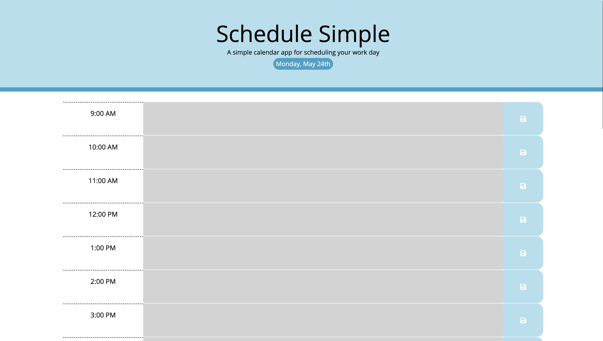

# [Schedule Simple](https://sonali-pandey.github.io/schedule-simple/)
### A simple calendar app for scheduling your work day

## Features:
* Minimalistic UI
* Shows current day and date.
* Organize your work day ( 9am - 5pm ).
* Color-coding based on past, present, or future hours: making it easier to track your day.
* Add the tasks/events by just clicking on the text-area.
* Save button to save you hourly tasks/events. Keeps it in the app as long as you need them.
* Clear the tasks/events and save to remove the tasks.

## Screen:

## Libraries:
* jQuery
* Day.js
* Bootstrap

## Thank you
### Created by: Sonali Pandey
